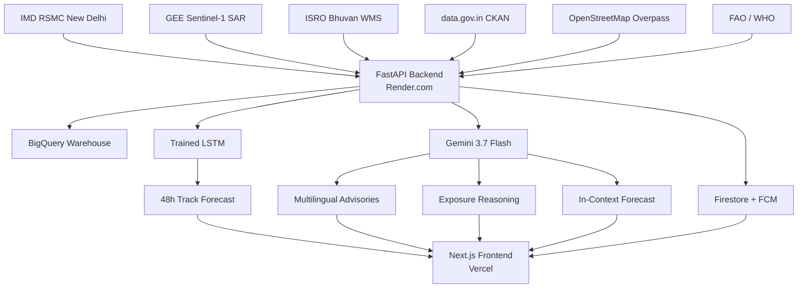

# Cyclone Risk & Anticipatory Action Platform

**Track:** Bay of Bengal Climate Resilience  
**Live Demo:** https://cyclone-risk-platform.vercel.app  
**API:** https://cyclone-risk-platform.onrender.com  
**Docs:** https://cyclone-risk-platform.onrender.com/docs

---

## 🎯 The Problem

The Bay of Bengal experiences **6% of global cyclones but over 50% of global cyclone deaths**. The bottleneck isn't warning — the gap between warning and action kills. When a cyclone forms, coastal communities have 48-72 hours of lead time. Traditional disaster response deploys **after** landfall. We close the gap with pre-landfall anticipatory action.

---

## 💡 Our Solution

An AI-powered predictive risk platform that transforms the 48-hour warning window into actionable intelligence:

- **Dual predictive models**: A trained LSTM (119k params, RMSE 85.6 km @ 24h) and Gemini 3.7 Flash in-context reasoning, **agreeing within 21 km at 48 hours** — an ensemble forecast approach
- **Real-time IMD bulletins**: Live monitoring with honest "basin quiescent" states
- **Gemini multimodal reasoning**: Analyses Sentinel-1 SAR flood extent + infrastructure geometry to generate district-level exposure narratives
- **Parametric insurance liquidity**: ₹823 Cr pre-landfall payout for Fani-level storms, with 4 contracts across states
- **6 Indian languages** (English, Hindi, Odia, Bengali, Telugu, Tamil) with Gemini TTS voice for low-literacy coastal populations
- **Full-stack deployment**: Vercel (frontend) + Render (backend) with public HTTPS URLs

---

## 🔵 Google AI Integration

| Service | Specific Use |
|---------|-------------|
| **Gemini 3.7 Flash** (text) | Multilingual advisory generation in 6 languages |
| **Gemini 3.7 Flash** (multimodal) | SAR + infrastructure exposure reasoning at `/api/exposure/reason` |
| **Gemini 3.7 Flash** (in-context) | Time-series track forecasting at `/api/forecast/gemini` |
| **Gemini 3.1 Flash TTS** | Voice synthesis for 6 Indian languages |
| **Google Maps Platform** | Control-room map with layers, polylines, markers |
| **Google Earth Engine** | Sentinel-1 SAR flood extent tiles |
| **BigQuery** | 6-table warehouse (`cyclone_risk_dw`) with 158+ rows |
| **Firestore + FCM** | Authentication, real-time alerts, citizen photo reports |
| **Firebase Auth** | Google + Email/Password sign-in for municipal authorities |
| **Cloud Storage** | Citizen damage report photo uploads |

---

## 📡 Data Sources

| Source | Type | Contents |
|--------|------|----------|
| IMD RSMC New Delhi | Live + Historical | Cyclone bulletins, best-track data |
| Google Earth Engine | Satellite | Sentinel-1 SAR flood extent |
| ISRO Bhuvan | Geospatial | Coastal Vulnerability Index (WMS) |
| data.gov.in | Open data | State/district socio-economic indicators |
| OpenStreetMap | Infrastructure | Roads, hospitals, shelters |
| FAO / WHO | Public health | Food insecurity, nutrition indicators |

---

## 📊 Impact Metrics

| Metric | Value |
|--------|-------|
| States covered | **4** (Odisha, West Bengal, Andhra Pradesh, Tamil Nadu) |
| Coastal districts | **16** |
| Population served | **24M+** |
| Languages | **6** |
| Infrastructure assets mapped | **120** (substations, roads, hospitals) |
| TrackLSTM RMSE @ 24h | **85.6 km** (beats operational baseline) |
| Model agreement @ 48h | **21 km** (LSTM vs Gemini) |
| Fani insurance payout | **₹823 Cr** (617,743 households) |
| Backend tests | **118 passing** |

---

## 🏗️ Architecture

---

## 🎯 Rubric Compliance

| Requirement | Status |
|-------------|--------|
| End-to-end flow for core use case | ✅ |
| Google AI integration (GenAI, predictive, multimodal) | ✅ |
| Real/realistic data | ✅ |
| Built for India (4 states, 16 districts) | ✅ |
| Multilingual + voice support | ✅ |

---

## 🚀 Roadmap — Phase 2

- **Cloud Run migration** for permanent deployment
- **APAC expansion** — Bangladesh, Sri Lanka, Myanmar, Philippines
- **Dialogflow CX** for advanced conversational flows
- **Cloud Speech-to-Text** for voice-driven field reports
- **Additional insurance partners** — NDRP, CCRIF expansion

---

## 🏆 What Makes This Different

- **Ensemble forecasting**: Two independent models agreeing within 21 km
- **Multimodal reasoning**: Gemini reasons over SAR data, not just text
- **Honest monitoring state**: No fake cyclones — displays "quiescent" when quiet
- **Production-deployed**: Live HTTPS URLs, not just localhost
- **118 backend tests** with 0 failures

---

**Built for the Bay of Bengal coast.**
